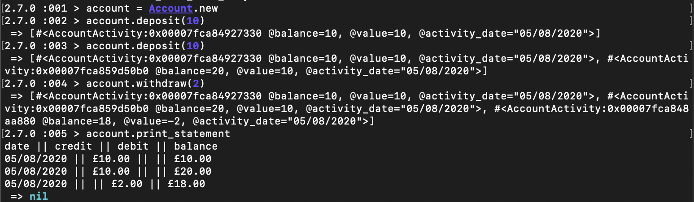

### Bank Tech Test - Ruby

A small project designed to highlight my code quality and process. [source](https://github.com/makersacademy/course/blob/master/individual_challenges/bank_tech_test.md)

I have also completed this tech test in [Node.js](https://github.com/tristanlangford/bank_tech_test)

It allows you to create an account, deposit, withdraw, and print statements.

## To run

1. Clone this repo.

2. Install dependencies with:

```shell
bundle install
```

3. Run tests with:

```shell
rspec
```

4. Rub the Ruby REP with account.rb file:

```shell
irb -r ./account.rb
```

5. Create an account with:

```shell
account = Account.new
```

6. 7. Use the account with the following methods:

| Method                     | Description                                                                                        |
| -------------------------- | -------------------------------------------------------------------------------------------------- |
| `account.deposit(number)`  | deposit however much you want into your account, this figure is in pounds with pence as decimals.  |
| `account.withdraw(number)` | withdraw however much you want from your account, this figure is in pounds with pence as decimals. |
| `account.print_statement()`      | prints a statement of all transactions so far                                                      |

## Example Screenshot



## Approach

### Project Setup

```shell
git init
```

```shell
bundle init
```

Added rspec, rubocop & simplecov to Gemfile

```shell
bundle install
```

### Project Plan

Identified 3 clear classes:

1. Account (will hold the balance, a record of interactions, be used for requesting a statement)

2. Interaction (will hold a single interaction, including the action, post action balance and date of interaction)

3. Statement (will be used to print the Account data)

### Account 

Began with the data that would be stored upon initialization, a balance at 0 and an empty array to hold the record of account activities. Before writing any code, I wrote tests on functions that would return these values, and then implemented the code to make the tests pass.

I then added a push method to both withdraw and deposit to mock the information that would be stored in the AccountActivity class to test that the methods added a value to account_history array while I worked on creating the AccountActitivy class.

### AccountActivity

I only wanted this class to hold the date of interaction, the new balance, and the amount deposited or withdrawn. The new balance and amount were passed in as arguments in on initialize and I decided to use the date of creation, but formated to a string. To test the date creation and formatting, I used the Timecop Gem to freeze time.

### Return to Account

I added the AccountActivity to Account using dependency injection so I could mock the class in my tests. I then refactored my tests and code accordingly

### PrintStatement

I passed an account_history as an argument on initialize that would match the account_history array in Account.

I created 3 doubles of activities for the tests, mocking the outputs from the instance variables used in the AccountActivity class.

I started with a statement array that would be updated to hold all information, and created it with the headings already included.

I then used TDD to get the string outputs from the activities in terms of whether it was in the credit or debit columns on the output.

I created a private method to format the values to two decimal places to match the format of currency, and included this function in the formatting of a deposit & withdrawal.

Finally I created a print method that would join the statement array with line breaks to match the test criteria and 'puts' the outcome.

### Return to Account again

Finally I included a print_statement method in Account and used dependency injection to mock this class, used a double in the tests which when .new was called, it would return a mock of a PrintStatement instance and tested whether .print was called on this double.
